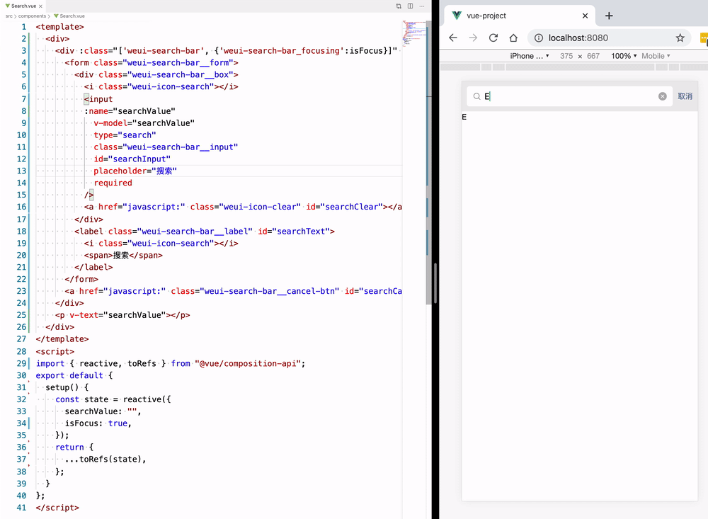
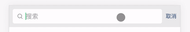

# Quick Start

本项目综合运用了 `Vue3.0` 的新特性，适合新手学习😁

- 基于 `Composition API` 即 `Function-based AP` I进行改造，配合 `Vue Cli`，优先体验 `Vue3` 特性
- 使用单例对象模式进行组件通信
- 使用 axios 库进行网络请求，weui 库实现 UI 界面

```bash
# 安装依赖
npm install
# 在浏览器打开localhost:8080查看页面，并实时热更新
npm run serve
# 发布项目
npm run build
```

建议配合 Visual Studio Code 和 [Vue 3 Snippets](https://github.com/Wscats/vue-snippets) 代码插件食用Ψ(￣∀￣)Ψ。

# Dependencies

以下是项目运用到的依赖，`@vue/composition-api` 配合 `vue` 模块让我们 `Vue2.0` 版本可以抢先体验 `Vue3.0` 的新特性，`axios` 是辅助我们发送网络请求得到数据的工具库，`weui`是一套与微信原生视觉一致的基础样式库，方便我们快速搭建项目页面。

```js
"@vue/composition-api": "^0.3.4",
"axios": "^0.19.0",
"core-js": "^3.4.3",
"vue": "^2.6.10",
"weui": "^2.1.3"
```

# Directory Structure

```js
├── src
│   ├── App.vue                          # 组件入口
│   ├── assets                           # 资源目录
│   ├── stores/index.js                  # 状态管理
│   ├── components                       # 组件目录
│   │   ├── Header.vue                   # 头部组件
│   │   ├── Search.vue                   # 搜索框组件
│   │   ├── Panel.vue                    # 列表组件
│   ├── main.js                          # 项目入口
├── public                               # 模板文件
├── vue.config.js                        # 脚手架配置文件
├── screenshot                           # 程序截图
```


# Composition API

```bash
npm install @vue/composition-api --save
```

使用 `npm` 命令下载了 `@vue/composition-api` 插件以后，引入该模块后，需要显式调用 `Vue.use(VueCompositionApi)` ，按照文档在 `main.js` 引用便开启了 `Composition API` 的能力。
```js
// main.js
import Vue from 'vue'
import App from './App.vue'
// 1.引入Composition API模块
import VueCompositionApi from '@vue/composition-api'

Vue.config.productionTip = false
// 2.不要漏了显式调用 VueCompositionApi
Vue.use(VueCompositionApi)

new Vue({
  render: h => h(App),
}).$mount('#app')
```


```bash
npm install weui --save
```

我们同样使用 `npm` 安装 `weui` 模块，然后在 `main.js` 中引入 `weui`的基础样式库，方便我们可以在全局使用微信基础样式构建项目页面。

```js
// main.js
import Vue from 'vue'
import App from './App.vue'
// 全局引入 `weui` 的基础样式库
import 'weui'
import VueCompositionApi from '@vue/composition-api'

Vue.config.productionTip = false
Vue.use(VueCompositionApi)

new Vue({
  render: h => h(App),
}).$mount('#app')
```

回到 `App.vue`，保留 `components` 属性值清空 `<template>` 模板的内容，删除 `<style>` 模板，等待重新引入新的组件。

```html
<template>
  <div id="app">
    Hello World
  </div>
</template>
<script>
export default {
  name: "app",
  components: {}
};
</script>
```
在 `src/components` 目录下新建第一个组件，取名为 `Header.vue` 写入以下代码，[点击查看源代码](https://github.com/Wscats/vue-cli/blob/master/src/components/Header.vue)：

```html
<template>
  <header :style="{
    backgroundColor: color?color:defaultColor
  }">{{title}}</header>
</template>
<script>
import { reactive } from "@vue/composition-api";
export default {
  // 父组件传递进来更改该头部组件的属性值
  props: {
    // 标题
    title: String,
    // 颜色
    color: String
  },
  setup() {
    const state = reactive({
      defaultColor: "red"
    });
    return {
      ...state
    };
  }
};
</script>
<style scoped>
header {
  height: 50px;
  width: 100%;
  line-height: 50px;
  text-align: center;
  color: white;
}
</style>
```

---

## setup

这里运用了一个全新的属性 `setup` ，这是一个组件的入口，让我们可以运用 `Vue3.0` 暴露的新接口，它运行在组件被实例化时候，`props` 属性被定义之后，实际上等价于 `Vue2.0` 版本的 `beforeCreate` 和 `Created` 这两个生命周期，`setup` 返回的是一个对象，里面的所有被返回的属性值，都会被合并到 `Vue2.0` 的 `render` 渲染函数里面，在单文件组件中，它将配合 `<template>` 模板的内容，完成 `Model` 到 `View` 之间的绑定，在未来版本中应该还会支持返回 `JSX` 代码片段。

```html
<template>
  <!-- View -->
  <div>{{name}}</div>
</template>
<script>
import { reactive } from '@vue/composition-api'
export default {
  setup() {
    const state = reactive({ name: 'Eno Yao' });
    // return 暴露到 template 中
    return {
      // Model
      ...state
    }
  }
}
</script>
```

## reactive

在 `setup` 函数里面， 我们适应了 Vue3.0 的第一个新接口 `reactive` 它主要是处理你的对象让它经过 `Proxy` 的加工变为一个响应式的对象，类似于 `Vue2.0` 版本的 `data` 属性，需要注意的是加工后的对象跟原对象是不相等的，并且加工后的对象属于深度克隆的对象。

```js
const state = reactive({ name: 'Eno Yao' })
```

## props

在 `Vue2.0` 中我们可以使用 `props` 属性值完成父子通信，在这里我们需要定义 `props` 属性去定义接受值的类型，然后我们可以利用 `setup` 的第一个参数获取 `props` 使用。
```js
export default {
  props: {
    // 标题
    title: String,
    // 颜色
    color: String
  },
  setup(props) {
    // 这里可以使用父组件传过来的 props 属性值
  }
};
```

我们在 `App.vue` 里面就可以使用该头部组件，有了上面的 `props` 我们可以根据传进来的值，让这个头部组件呈现不同的状态。
```html
<template>
  <div id="app">
    <!-- 复用组件，并传入 props 值，让组件呈现对应的状态 -->
    <Header title="Eno" color="red" />
    <Header title="Yao" color="blue" />
    <Header title="Wscats" color="yellow" />
  </div>
</template>
<script>
import Header from "./components/Header.vue";
export default {
  name: "app",
  components: {
    Header,
  }
};
</script>
```


## context

`setup` 函数的第二个参数是一个上下文对象，这个上下文对象中包含了一些有用的属性，这些属性在 `Vue2.0` 中需要通过 `this` 才能访问到，在 `vue3.0` 中，访问他们变成以下形式：

```js
setup(props, ctx) {
  console.log(ctx) // 在 setup() 函数中无法访问到 this
  console.log(this) // undefined
}
```

具体能访问到以下有用的属性：

- root
- parent
- refs
- attrs
- listeners
- isServer
- ssrContext
- emit

---

完成上面的 `Header.vue` 我们就编写 `Search.vue` 搜索框组件，继续再 `src/components` 文件夹下面新建 `Search.vue` 文件，[点击查看源代码](https://github.com/Wscats/vue-cli/blob/master/src/components/Search.vue)。

```html
<template>
  <div :class="['weui-search-bar', {'weui-search-bar_focusing' : isFocus}]" id="searchBar">
    <form class="weui-search-bar__form">
      <div class="weui-search-bar__box">
        <i class="weui-icon-search"></i>
        <input
          v-model="searchValue"
          ref="inputElement"
          type="search"
          class="weui-search-bar__input"
          id="searchInput"
          placeholder="搜索"
          required
        />
        <a href="javascript:" class="weui-icon-clear" id="searchClear"></a>
      </div>
      <label @click="toggle" class="weui-search-bar__label" id="searchText">
        <i class="weui-icon-search"></i>
        <span>搜索</span>
      </label>
    </form>
    <a @click="toggle" href="javascript:" class="weui-search-bar__cancel-btn" id="searchCancel">取消</a>
  </div>
</template>
<script>
import { reactive, toRefs, watch } from "@vue/composition-api";
import store from "../stores";
export default {
  // setup相当于2.x版本的beforeCreate生命周期
  setup() {
    // reactive() 函数接收一个普通对象，返回一个响应式的数据对象
    const state = reactive({
      searchValue: "",
      // 搜索框两个状态，聚焦和非聚焦
      isFocus: false,
      inputElement: null
    });
    // 切换搜索框状态的方法
    const toggle = () => {
      // 让点击搜索后出现的输入框自动聚焦
      state.inputElement.focus();
      state.isFocus = !state.isFocus;
    };
    // 监听搜索框的值
    watch(
      () => {
        return state.searchValue;
      },
      () => {
        // 存储输入框到状态 store 中心，用于组件通信
        store.setSearchValue(state.searchValue);
        // window.console.log(state.searchValue);
      }
    );
    return {
      // 将 state 上的每个属性，都转化为 ref 形式的响应式数据
      ...toRefs(state),
      toggle
    };
  }
};
</script>
```

## toRefs

可以看到我们上面用了很多的新属性，我们先介绍 `toRefs` ，函数可以将 `reactive()` 创建出来的响应式对象，转换为普通的对象，只不过，这个对象上的每个属性节点，都是 `ref()` 类型的响应式数据，配合 `v-model` 指令能完成数据的双向绑定，在开发中非常高效。

```js
import { reactive, toRefs } from "@vue/composition-api";
export default {
  setup() {
    const state = reactive({ name: 'Eno Yao' })
  }
  return {
    // 直接返回 state 那么数据会是非响应式的， MV 单向绑定
    // ...state,
    // toRefs 包装后返回 state 那么数据会是响应式的， MVVM 双向绑定
    ...toRefs(state),
  };
}
```



## template refs

这里的输入框拥有两个状态，一个是有输入框的状态和无输入框的状态，所以我们需要一个布尔值 `isFocus` 来控制状态，封装了一个 `toggle` 方法，让 `isFocus` 值切换真和假两个状态。
```js
const toggle = () => {
  // isFocus 值取反
  state.isFocus = !state.isFocus;
};
```
然后配合 `v-bind:class` 指令，让 `weui-search-bar_focusing` 类名根据 `isFocus` 值决定是否出现，从而更改搜索框的状态。
```html
<div :class="['weui-search-bar', {'weui-search-bar_focusing' : isFocus}]" id="searchBar">
```
这里的搜索输入框放入了 `v-model` 指令，用于接收用户的输入信息，方便后面配合列表组件执行检索逻辑，还放入了 `ref` 属性，用于获取该 `<input/>` 标签的元素节点，配合`state.inputElement.focus()` 原生方法，在切换搜索框状态的时候光标自动聚焦到输入框，增强用户体验。
```html
<input
  v-model="searchValue"
  ref="inputElement"
/>
```



## watch

`watch()` 函数用来监视某些数据项的变化，从而触发某些特定的操作，使用之前还是需要按需导入，监听 `searchValue` 的变化，然后触发回调函数里面的逻辑，也就是监听用户输入的检索值，然后触发回调函数的逻辑把 `searchValue` 值存进我们创建 `store` 对象里面，方面后面和 `Panel.vue` 列表组件进行数据通信：

```js
import { reactive, watch } from "@vue/composition-api";
import store from "../stores";
export default {
  setup() {
    const state = reactive({
      searchValue: "",
    });
    // 监听搜索框的值
    watch(
      () => {
        return state.searchValue;
      },
      () => {
        // 存储输入框到状态 store 中心，用于组件通信
        store.setSearchValue(state.searchValue);
      }
    );
    return {
      ...toRefs(state)
    };
  }
};
```

## state management

在这里我们维护一份数据来实现共享状态管理，也就是说我们新建一个 `store.js` 暴露出一个 `store` 对象共享 `Panel` 和 `Search` 组件的 `searchValue` 值，当 `Search.vue` 组件从输入框接受到 `searchValue` 检索值，就放到 `store.js` 的 `store` 对象中，然后把该对象注入到 `Search` 组件中，那么两个组件都可以共享 `store` 对象中的值，为了方便调试我们还分别封装了 `setSearchValue` 和 `getSearchValue` 来去操作该 `store` 对象，这样我们就可以跟踪状态的改变。

```js
// store.js
export default {
    state: {
        searchValue: ""
    },
    // 设置搜索框的值
    setSearchValue(value) {
        this.state.searchValue = value
    },
    // 获取搜索框的值
    getSearchValue() {
        return this.state.searchValue
    }
}
```

---

完成上面的 `Search.vue` 我们紧接着编写 `Panel.vue` 搜索框组件，继续再 `src/components` 文件夹下面新建 `Panel.vue` 文件，[点击查看源代码](https://github.com/Wscats/vue-cli/blob/master/src/components/Panel.vue)。

```html
<template>
  <div class="weui-panel weui-panel_access">
    <div v-for="(n,index) in newComputed" :key="index" class="weui-panel__bd">
      <a href="javascript:void(0);" class="weui-media-box weui-media-box_appmsg">
        <div class="weui-media-box__hd">
          
        </div>
        <div class="weui-media-box__bd">
          <h4 class="weui-media-box__title" v-text="n.title"></h4>
          <p class="weui-media-box__desc" v-text="n.author.loginname"></p>
        </div>
      </a>
    </div>
    <div @click="loadMore" class="weui-panel__ft">
      <a href="javascript:void(0);" class="weui-cell weui-cell_access weui-cell_link">
        <div class="weui-cell__bd">查看更多</div>
        <span class="weui-cell__ft"></span>
      </a>
    </div>
  </div>
</template>
<script>
import { reactive, toRefs, onMounted, computed } from "@vue/composition-api";
import axios from "axios";
import store from "../stores";
export default {
  setup() {
    const state = reactive({
      // 页数
      page: 1,
      // 列表数据
      news: [],
      // 通过搜索框的值去筛选劣列表数据
      newComputed: computed(() => {
        // 判断是否输入框是否输入了筛选条件，如果没有返回原始的 news 数组
        if (store.state.searchValue) {
          return state.news.filter(item => {
            if (item.title.indexOf(store.state.searchValue) >= 0) {
              return item;
            }
          });
        } else {
          return state.news;
        }
      }),
      searchValue: store.state
    });
    // 发送 ajax 请求获取列表数据
    const loadMore = async () => {
      // 获取列表数据
      let data = await axios.get("https://cnodejs.org/api/v1/topics", {
        params: {
          // 每一页的主题数量
          limit: 10,
          // 页数
          page: state.page
        }
      });
      // 叠加页数
      state.page += 1;
      state.news = [...state.news, ...data.data.data];
    };
    onMounted(() => {
      // 首屏加载的时候触发请求
      loadMore();
    });
    return {
      // 让数据保持响应式
      ...toRefs(state),
      // 查看更多事件
      loadMore
    };
  }
};
</script>
```

# lifecycle hooks

`Vue3.0` 的生命周期钩子和之前不一样，新版本都是以 `onXxx()` 函数注册使用，同样需要局部引入生命周期的对应模块：

```js
import { onMounted, onUpdated, onUnmounted } from "@vue/composition-api";
export default {
  setup() {
    const loadMore = () => {};
    onMounted(() => {
      loadMore();
    });
    onUpdated(() => {
      console.log('updated!')
    })
    onUnmounted(() => {
      console.log('unmounted!')
    })
    return {
      loadMore
    };
  }
};
```

以下是新旧版本生命周期的对比：

- <s>`beforeCreate`</s> -> use `setup()`
- <s>`created`</s> -> use `setup()`
- `beforeMount` -> `onBeforeMount`
- `mounted` -> `onMounted`
- `beforeUpdate` -> `onBeforeUpdate`
- `updated` -> `onUpdated`
- `beforeDestroy` -> `onBeforeUnmount`
- `destroyed` -> `onUnmounted`
- `errorCaptured` -> `onErrorCaptured`

同时新版本还提供了两个全新的生命周期帮助我们去调试代码：

- onRenderTracked
- onRenderTriggered

在 `Panel` 列表组件中，我们注册 `onMounted` 生命周期，并在里面触发请求方法 `loadMore` 以便从后端获取数据到数据层，这里我们使用的是 `axios` 网络请求库，所以我们需要安装该模块：

```bash
npm install axios --save
```
封装了一个请求列表数据方法，接口指向的是 `Cnode` 官网提供的 `API` ，由于 `axios` 返回的是 `Promise` ，所以配合 `async` 和 `await` 可以完美的编写异步逻辑，然后结合`onMounted` 生命周期触发，并将方法绑定到视图层的查看更多按钮上，就可以完成列表首次的加载和点击查看更多的懒加载功能。
```js
// 发送 ajax 请求获取列表数据
const loadMore = async () => {
  // 获取列表数据
  let data = await axios.get("https://cnodejs.org/api/v1/topics", {
    params: {
      // 每一页的主题数量
      limit: 10,
      // 页数
      page: state.page
    }
  });
  // 叠加页数
  state.page += 1;
  // 合并列表数据
  state.news = [...state.news, ...data.data.data];
};
```


# License

Copyright(C) 2019, [Vue Cli](https://github.com/Wscats/vue-cli) is released under the [MIT](http://opensource.org/licenses/MIT).